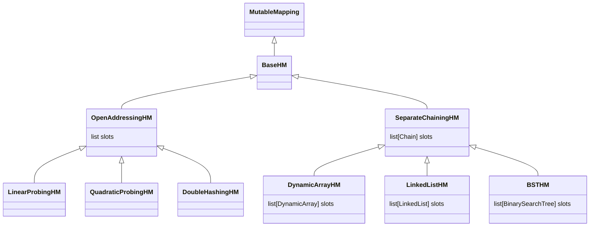
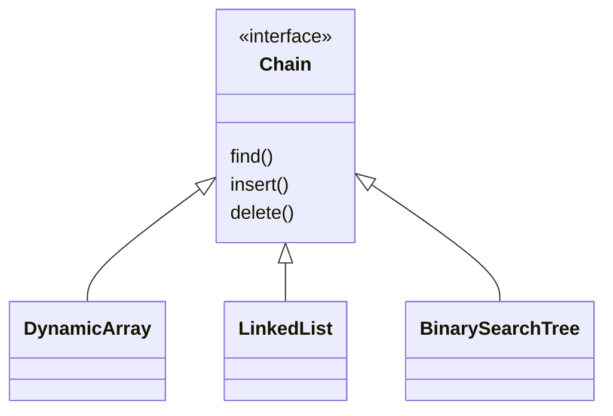

## Introduction

`pyhashmaps` is a fully annotated Python package which has several functional hashmap classes for educational purposes.

All classes support common operations on [ `MutableMapping` ](https://docs.python.org/3/library/collections.abc.html#collections.abc.MutableMapping) type.

Here are the relationships between components of this package:





# Requirements

It's tested on Python 3.10 & 3.11.

# Installation

If you have `git` installed:

```none
pip install git+https://github.com/amirsoroush/Python_Hashmaps.git
```

Otherwise:

```none
pip install https://github.com/amirsoroush/Python_Hashmaps/tarball/main
```

# Usage

It has the same interface as the built-in `dict` class.

```python
>>> from pyhashmaps import (
...                     LinearProbingHashMap,
...                     QuadraticProbingHashMap,
...                     DoubleHashingHashMap,
...                     DynamicArrayHashMap,
...                     LinkedListHashMap,
...                     BSTHashMap,
...                     )
>>>
>>> hashmap = LinearProbingHashMap()
>>> hashmap = LinearProbingHashMap[str, int]()
>>> hashmap["a"] = 10
>>> hashmap
LinearProbingHashMap({'a': 10})
>>> hashmap.update({"b": 20, "c": 30})
>>> len(hashmap)
3
>>> for k, v in hashmap.items():
...     print(k, v)
... 
c 30
a 10
b 20
>>> hashmap.clear()
>>> 
```
